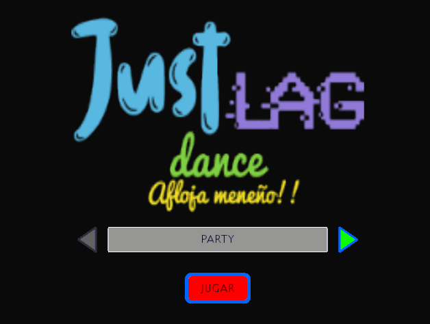

# JustLag Dance
El trabajo que hemos desarrollado se basa en el mítico juego de consolas Just Dance y sus derivados. 
Una descripción simple de este juego popular consiste en que el jugador tiene que mostrar su destreza bailando, 
adquiriendo posturas corporales que la interfaz le indique con la finalidad de conseguir una gran puntuación. 
Para conseguir capturar las posturas del jugador, se hace uso de una Kinnect.

Nuestro prototipo es una versión muy simplificada del juego anteriormente mencionado, en el que el jugador puede 
seleccionar una canción de un repertorio que se encuentra en la pantalla principal, escribir su nombre de jugador y 
elegir entre una selección de máscaras una que llevará el esqueleto durante la partida, para seguidamente comenzar 
con el baile.

